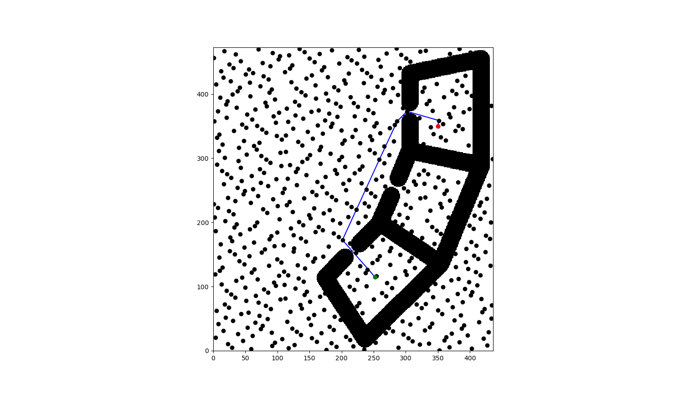
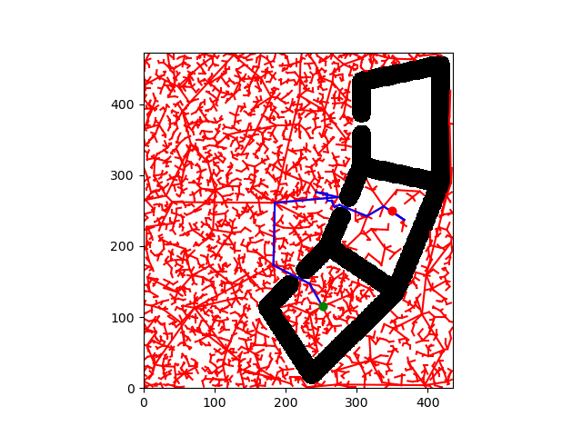
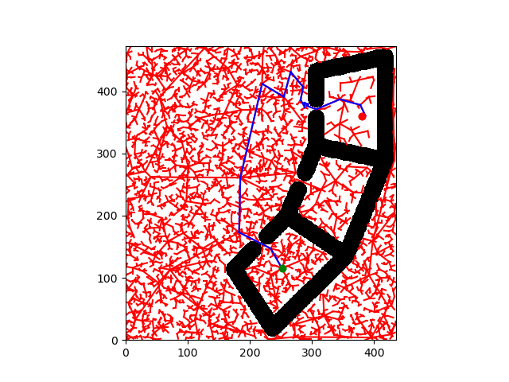
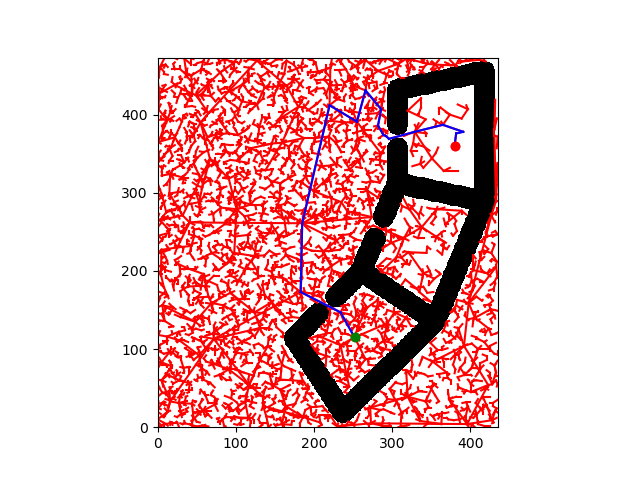
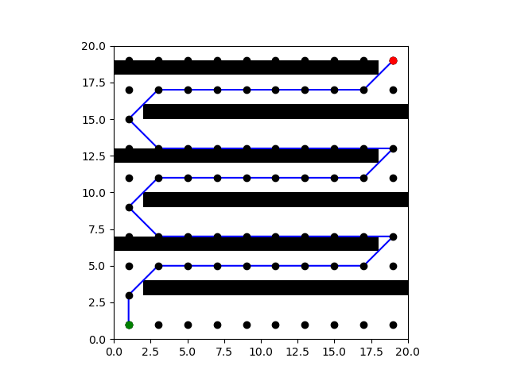
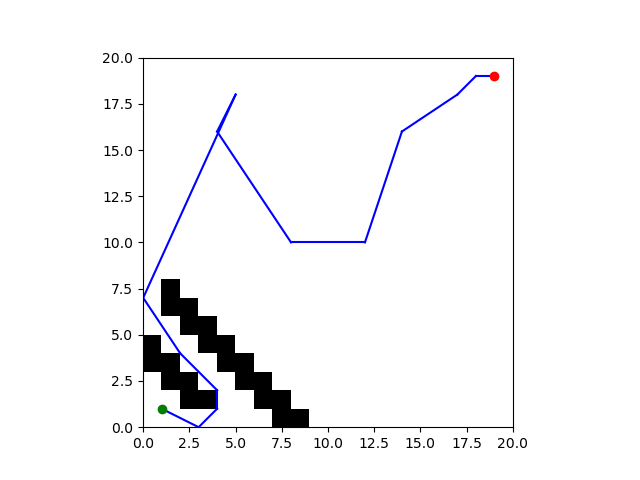

# Project 4: Planning

Replace this with your own writeup! Please place all figures and answer all questions in this directory.

**Q1.2** 

A* Shortest Path Figure: ...

python3 scripts/run_astar -m test/share/map2.txt -n 600 -r 100 r2 -s 252 115 -g 350 350 
Vertices: 600
Edges: 19907
Running A*
Path: [600, 513, 149, 16, 441, 540, 304, 601]
Path length: 362.88692665140957
Planning time: 1.44875168800354
Edges evaluated: 23016

**Q2.1** 

RRT Path Figure: ...

python3 scripts/run_rrt -m test/share/map2.txt -s 252 115 -g 350 250 --show-tree -size 100 
Planning complete!
Plan: [[252. 115.]
 [234. 147.]
 [183. 173.]
 [185. 261.]
 [274. 269.]
 [243. 276.]
 [258. 274.]
 [259. 264.]
 [265. 264.]
 [267. 259.]
 [269. 255.]
 [276. 258.]
 [315. 242.]
 [316. 243.]
 [338. 256.]
 [367. 237.]
 [357. 244.]
 [350. 250.]]
Cost: 471.000000
Planning Time: 62s
Sampled Collisions: 1119

**Q2.2** 

RRT Path Figure For Saved Tree: 

Planning time report:

[Create saved tree]
Cost: 471.000000
Planning Time: 64s
Sampled Collisions: 1119

[Use saved tree]
Cost: 610.000000
Planning Time: 56s
Sampled Collisions: 44

[From scratch]
Cost: 613.000000
Planning Time: 131s
Sampled Collisions: 1203

In this example reusing the RTT tree does make tbe planning more efficient as it completes with a cost of 610 in 56 seconds using the saved tree as opposed to spending 131 seconds for a cost of 612 without a saved tree. The time to generate the first tree was 64 seconds with a cost of 471, so the total time of using the saved tree is 11 seconds faster but comes with a larger cost plus the effort required in saving storing and pulling the saved files.

Reusing the saved tree is useful in cases where the new goal is already near already explored configuration space. In this case, though the new goal/s tight enclosure is not already explored, there are several nodes that are nearby the entrance, allowing quick exploration when reusing. This saves time in comparison to entirely re-exploring the whole R2space again.

On the otherhand, cases where the environment is changing, the tree is prone to biasing or error, or if the goal is in an entirely new space that is far away, using a saved tree would actually be inefficient or even harmful. This is because each of these conditions would either invalidate the existing tree or bias the tree away from the desired goal.

**Q3**

Since the lattice nodes are not randomly disperesed as they were previously, the first map is designed to create quick paths between these lattices, while the second map is designed to prevent any connections.

A* beats RRT Figure:

A* is better than RRT because the long straight corridors or this map perfectly align with the lattice grid that Astar places in the space. Edges between neighbors as it approaches the goal consistently remain within the corridors. RTT on the other hand searches based off a randomly generated destination, but in this case the vast majority of points will exist past or within one of the corridor walls resulting in inefficient collisions.

RRT beats A* Figure:

RRT is better than A* because the map consists of a tight corridor that does not align with the Astar's lattices. This means Astar is unable to find a path since the walls that make up the corridor intersect any valid path between lattice nodes. On the otherhand there is still a valid path, so rrt which takes a random position in the graph to check progression towards goal is still able to find a path through this newe corridor.

**Q5**

A* heuristic design decisions:

I chose to design my heurisitc model to calculate the joint-space cost, the sum of all minimal angular differences across the six joints. This inherently matches the cost function of compute_distance() and relates directly to the distance the arm must rotate to meet the goal. I used the provided distance measure to quickly calculate this while also taking the angular wrapping at 2pi into account given it is implemented in computer_distance(). Since compute_distance() returns an array, I index this array at element 0 to produce a single scalar as apposed to a vector. Due to experiencing an error involving floating point error, I incoportated the small delat of epsilon to subtract from this join-space cost. This passes the error where the calculated cost would exceed the real cost. Additionally the calculated cost is clipped at 0 so that there is no negative cost.